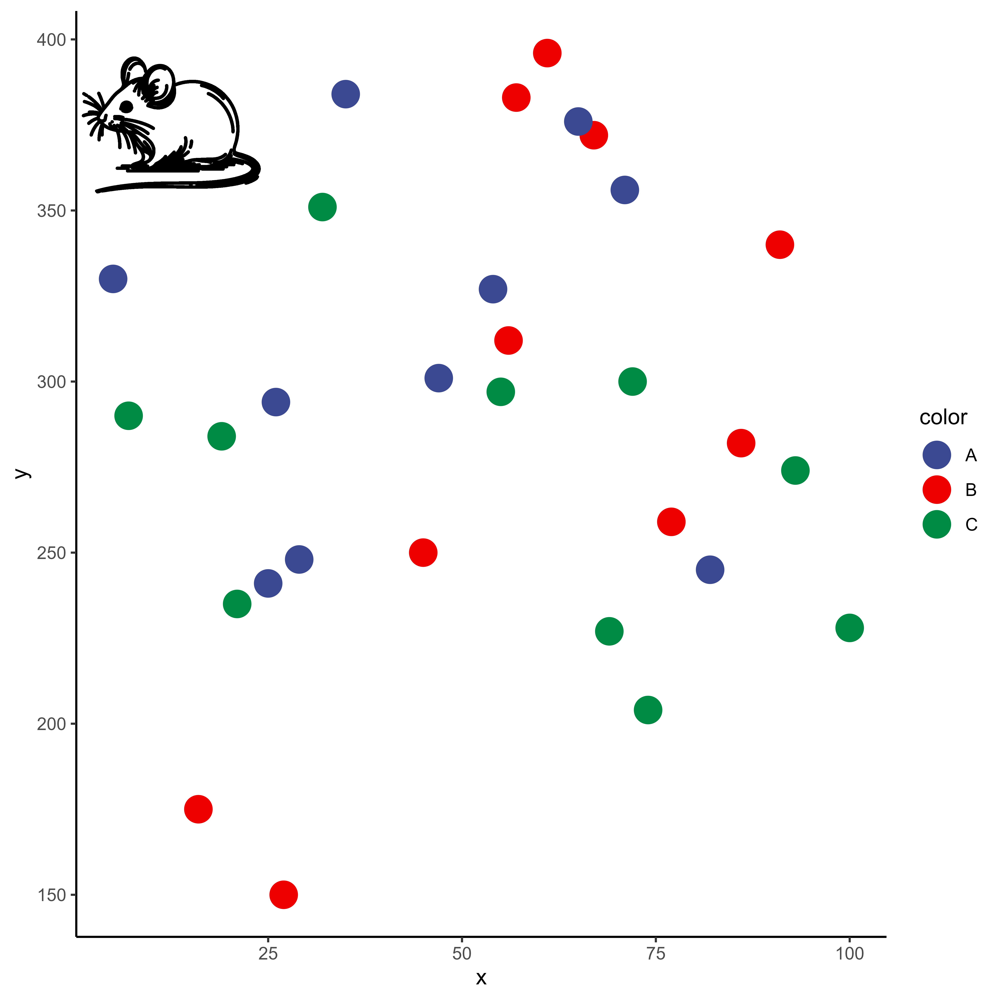

# ggiconZY

`ggiconZY` is an R package for adding reusable scientific illustrations to
`ggplot2` figures. It bundles coordinate data for biological icons and helpers
for drawing those icons alone, placing them inside another plot, and creating
customizable bacterial culture plates.

## Installation

Install the development version from GitHub:

```r
install.packages("remotes")
remotes::install_github("yzhong005/ggiconZY")
```

## Available icons

```r
library(ggiconZY)

ggicon_names()
#> [1] "drosophila" "male" "mouse" "panda" "singapore"
```

Load the original coordinates when you want full control:

```r
mouse <- ggicon_data("mouse")
head(mouse)
```

For a quick preview of a dense icon, limit the number of plotted points:

```r
ggicon_plot("panda", colour = "#1B1B1B", max_points = 30000)
```

## Add an icon to a ggplot

```r
library(ggplot2)

set.seed(123)
observations <- data.frame(
  x = sample(1:100, 30),
  y = sample(150:400, 30),
  group = rep(LETTERS[1:3], 10)
)

ggplot(observations, aes(x, y, colour = group)) +
  geom_point(size = 3) +
  annotation_ggicon(
    "mouse",
    xmin = 0,
    xmax = 25,
    ymin = 335,
    ymax = 405,
    max_points = 20000
  ) +
  theme_classic()
```



`annotation_ggicon()` uses the parent plot's data coordinates. Adjust `xmin`,
`xmax`, `ymin`, and `ymax` to control its position and size.

## Draw culture plates

```r
culture_plate_plot("streak")

culture_plate_plot(
  "disc",
  labels = c("TZP", "AMC", "MEM", "CTX", "TGC", "NEW"),
  inhibition = c(0.20, 0.10, 0.25, 0, 0.15, 0.18),
  isolate_id = "Isolate 01"
)
```

Both the agar and culture colours are customizable.

## Contributing

Bug reports and new icon proposals are welcome. See
[CONTRIBUTING.md](CONTRIBUTING.md) for the expected data format and validation
steps.

## Citation

If you use `ggiconZY` in research, please cite:

> Zhong, Yang. (2023). *ggiconZY*. Version 1.0.0.
> <https://github.com/yzhong005/ggiconZY>

Citation metadata is also available in [CITATION.cff](CITATION.cff).

## License

MIT © Yang Zhong. See [LICENSE.md](LICENSE.md).
