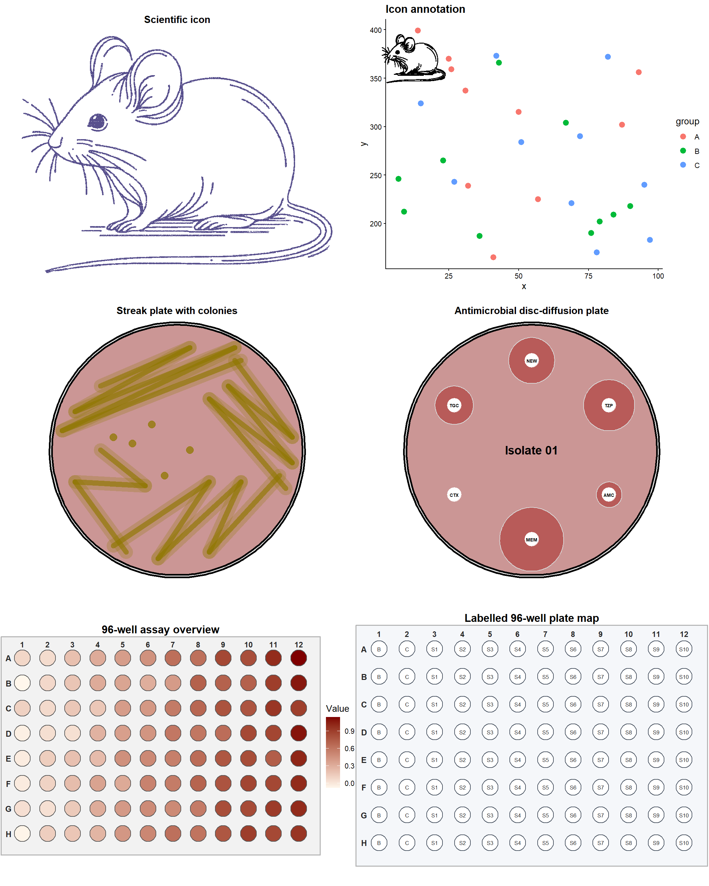
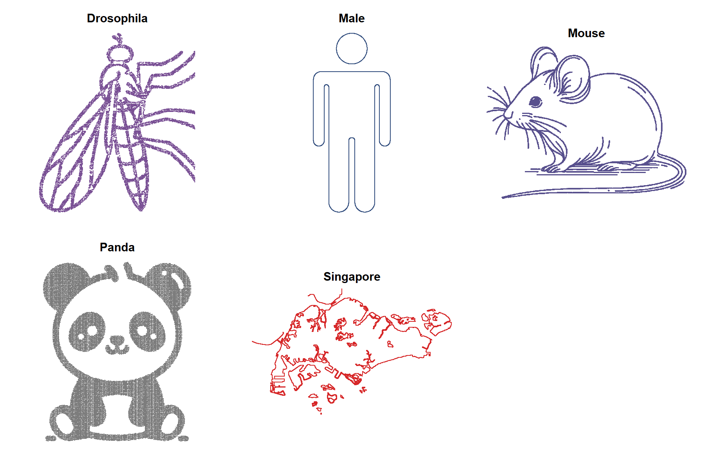
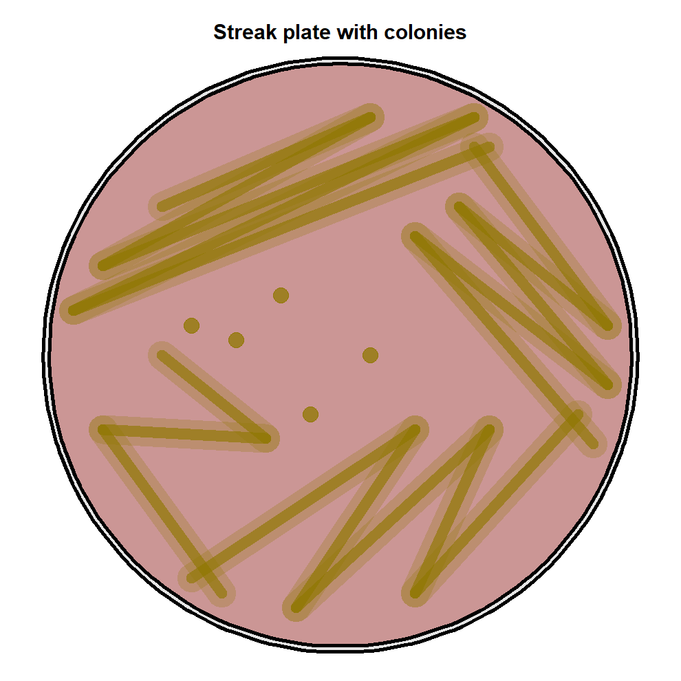
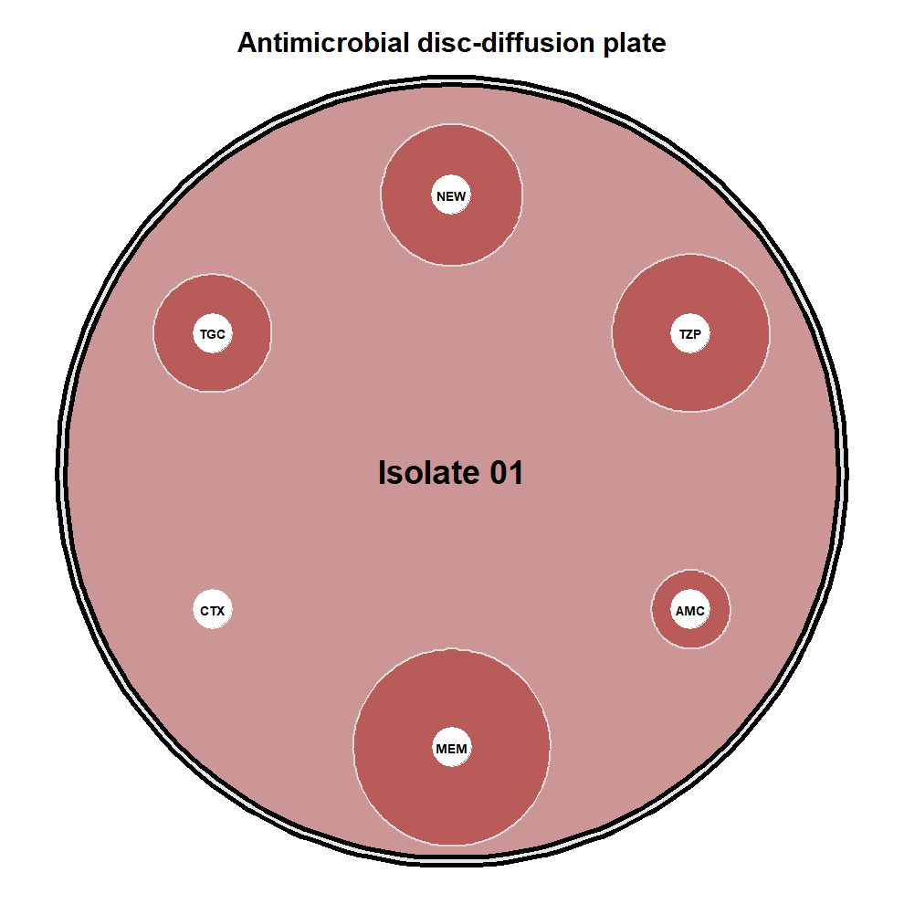
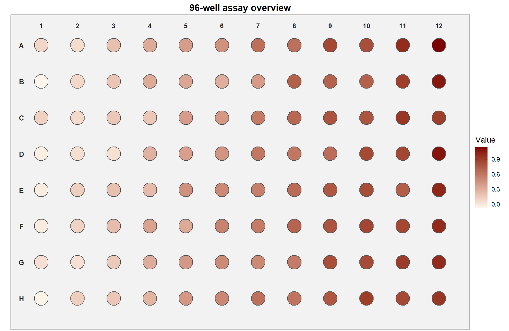
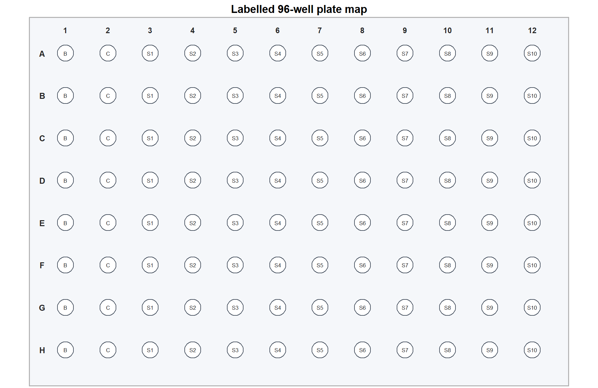

# Complete ggiconZY tutorial

`ggiconZY` creates reusable biological illustrations as real `ggplot2`
objects. This tutorial covers every plot and data helper currently included in
the package.



## What the package can create

| Capability | Main function | Result |
|---|---|---|
| Standalone scientific icons | `ggicon_plot()` | Drosophila, male symbol, mouse, panda, or Singapore silhouette |
| Icons inside another graph | `annotation_ggicon()` | A bundled icon positioned in any ggplot data region |
| Bacterial streak plates | `culture_plate_plot("streak")` | Agar plate with streak paths and isolated colonies |
| Disc-diffusion plates | `culture_plate_plot("disc")` | Labelled antimicrobial discs and configurable inhibition zones |
| 96-well microplates | `well_plate_plot()` | Blank layouts, labels, numeric assay heatmaps, and missing wells |
| Plate-reader import | `read_plate_reader()` | Standardized 8 by 12 matrix from CSV, text, or Excel exports |

All plotting functions return a `ggplot` object. You can add titles, themes,
and other compatible ggplot layers, or save the result with `ggsave()`.

## Installation

Install the development version from GitHub, then load the package:

```r
install.packages("remotes")
remotes::install_github("yzhong005/ggiconZY")

library(ggiconZY)
library(ggplot2)
```

Excel plate-reader files require the optional `readxl` package:

```r
install.packages("readxl")
```

## 1. Explore the bundled scientific icons

List the available icons:

```r
ggicon_names()
#> [1] "drosophila" "male" "mouse" "panda" "singapore"
```

Draw one icon as a standalone plot:

```r
mouse_plot <- ggicon_plot(
  "mouse",
  colour = "#58508D",
  size = 0.1,
  alpha = 1,
  max_points = 20000
)

mouse_plot
```



The `colour`, `size`, and `alpha` arguments control appearance.
`max_points` creates a faster deterministic preview of a dense icon without
changing the bundled data.

### Access the underlying coordinates

Use `ggicon_data()` when you want to inspect or transform the original x/y
coordinates yourself:

```r
mouse_data <- ggicon_data("mouse")
head(mouse_data)
```

The returned data frame always contains numeric `x` and `y` columns. The panda
also contains a `value` column used for its light-to-dark gradient.

## 2. Put an icon inside another ggplot

`annotation_ggicon()` places an icon inside the coordinate system of a parent
plot. The four bounds specify the rectangle occupied by the icon.

```r
set.seed(123)
observations <- data.frame(
  x = sample(1:100, 30),
  y = sample(150:400, 30),
  group = rep(LETTERS[1:3], 10)
)

ggplot(observations, aes(x, y, colour = group)) +
  geom_point(size = 3) +
  annotation_ggicon(
    "mouse",
    xmin = 0,
    xmax = 25,
    ymin = 335,
    ymax = 405,
    max_points = 20000
  ) +
  theme_classic()
```


The values for `xmin`, `xmax`, `ymin`, and `ymax` are parent-plot data values,
not pixels. Change them to move or resize the icon.

## 3. Draw bacterial culture plates

### Streak plate

```r
culture_plate_plot(
  "streak",
  medium_colour = "#B24745",
  culture_colour = "#8F7700"
)
```



The streak mode draws the agar, inoculation streaks, and isolated colonies.
Use `medium_colour` and `culture_colour` to match an experiment or figure
palette.

### Antimicrobial disc-diffusion plate

```r
culture_plate_plot(
  "disc",
  labels = c("TZP", "AMC", "MEM", "CTX", "TGC", "NEW"),
  inhibition = c(0.20, 0.10, 0.25, 0, 0.15, 0.18),
  isolate_id = "Isolate 01"
)
```



Supply one non-negative inhibition radius for every label. A value of zero
draws a disc without an inhibition zone. Any number of labels can be used; the
discs are spaced evenly around the plate.

## 4. Plot a 96-well microplate

`well_plate_plot()` accepts either an 8 by 12 numeric matrix or a length-96
vector. Vectors are read in row order: A1-A12, then B1-B12, through H1-H12.

```r
set.seed(42)
assay_values <- matrix(
  rep(seq(0, 1, length.out = 12), times = 8) + rnorm(96, sd = 0.06),
  nrow = 8,
  byrow = TRUE
)

well_plate_plot(
  assay_values,
  palette = c("#FFF7EC", "#7F0000")
)
```



### Display values or custom labels

```r
# Display formatted assay values in each well
well_plate_plot(assay_values, show_values = TRUE, value_digits = 2)

# Or provide 96 custom labels
sample_labels <- matrix(paste0("S", seq_len(96)), nrow = 8, byrow = TRUE)
well_plate_plot(assay_values, labels = sample_labels)
```

Use `NA` values for empty or failed wells. Customize them with `na_colour`.
The plate background, well outlines, label colour, well size, and two-colour
gradient are also configurable.

### Start with a blank plate

```r
well_plate_plot()
```

This creates a blank 8 by 12 layout that can be used as a plate map. Add a
matrix of labels to describe blanks, controls, and samples:

```r
plate_labels <- matrix("", nrow = 8, ncol = 12)
plate_labels[, 1] <- "B"
plate_labels[, 2] <- "C"
plate_labels[, 3:12] <- paste0("S", rep(1:10, each = 8))

well_plate_plot(labels = plate_labels)
```



## 5. Read a plate-reader export

`read_plate_reader()` converts common instrument exports into the 8 by 12
matrix required by `well_plate_plot()`.

```r
plate_values <- read_plate_reader(
  "plate_reader_export.xlsx",
  sheet = "OD600",
  skip = 2
)

well_plate_plot(
  plate_values,
  show_values = TRUE,
  palette = c("#F7FBFF", "#2166AC")
)
```

Supported files are CSV, TSV, TXT, XLS, and XLSX. The importer automatically
recognizes:

- 12 records numbered 1-12 with measurement columns A-H, matching the original
  ggiconZY plate-reader workflow;
- 8 records labelled A-H with measurement columns 1-12; and
- long-form tables containing well IDs such as A1 and H12 plus a numeric
  measurement column.

Use `sheet` for an Excel worksheet, `skip` when an instrument writes metadata
above the table, `layout` to override automatic layout detection, and
`value_column` when a long table contains multiple numeric measurements.

The dedicated [96-well plate tutorial](96-well-plate-tutorial.md) contains more
import layouts and troubleshooting examples.

## 6. Customize and save plots

Because the result is a ggplot, standard ggplot additions work:

```r
final_plot <- culture_plate_plot("streak") +
  labs(title = "Isolate A: quadrant streak") +
  theme(plot.title = element_text(face = "bold", hjust = 0.5))

ggsave(
  "isolate-a-streak-plate.png",
  final_plot,
  width = 6,
  height = 6,
  dpi = 300,
  bg = "white"
)
```

For publication, choose the final figure dimensions before adjusting text and
point sizes. A white background is useful when exporting plots built with
`theme_void()`.

## Function summary

| Function | Purpose | Returns |
|---|---|---|
| `ggicon_names()` | List all bundled icon names | Character vector |
| `ggicon_data()` | Load an icon's coordinate data | Data frame |
| `ggicon_plot()` | Draw a standalone icon | ggplot |
| `annotation_ggicon()` | Create an icon annotation layer | ggplot layer |
| `culture_plate_plot()` | Draw a streak or disc-diffusion plate | ggplot |
| `read_plate_reader()` | Import and standardize plate-reader data | 8 by 12 numeric matrix |
| `well_plate_plot()` | Draw a blank, labelled, or numeric 96-well plate | ggplot |

Runnable scripts are included in `inst/examples/`, including
`all-plots.R`, `icons.R`, `culture-plate.R`, `96-well-plate.R`, and
`plate-reader.R`.
